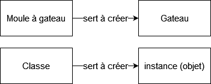

# Partie Python : Pokemon multifile

## 1. Introduction à la POO

Il existe plusieurs approche de structuration de programmation : l'approche procédurale, l'approche fonctionnelle (ocaml, scala, haskel, etc.) et la programmation orientée objet.

L'approche procédurale dissocie l'algorithme des données. Les algorithmes sont mis dans des procédures (fonctions) tandis que les données sont dans des variables/structure de données.

En programmation orientée objet les algorithmes et les données sont regroupés dans une structure commune, appelée "objet".

Dans beaucoup de langages dits objets, la structure d'un objet est spécifié par une classe.

## 2. Class versus object



## 3. Création de classe et objet

Le code suivant permet de créer une classe Person très simple.

1. A l'aide de la class Person, créer deux instances (objet) de la classe Person et les stocker dans des nommées p1 et p2 respectivement

2. Afficher l'age de p1 et l'age de p2.

3. Essayer de changer l'age de p2 à 18. Cela marche-t-il ?

```py
class Person:
    def __init__(self):
        self.age = 10

p1 = Person()
p2 = Person()

print("Âge de p1:", p1.age)
print("Âge de p2:", p2.age)

p2.age = 18

print("Nouvel âge de p2:", p2.age)
```

## 4. Objectif

L'objectif de la série d'exercice qui arrive et se familiariser davantage avec les concepts de la programmation orientée objet en faisant un système de jeu de pokemon.

Dans cet exercice et les suivants si vous souhaitez créez d'autres méthode que celles demandées, notamment pour rendre le code mieux structuré, vous êtes plus qu'en couragés!

## 5. Pokemon I

Rappel : Le constructeur est une fonction déclenchée à la création de chaque objet. Il permet d'initialiser les valeurs d'un objet quand nécessaire.

1. Créer une classe « Pokémon » qui permet d'initialiser les attributs name et life_point à la création d'un objet.

2. Instanciez un Pokemon dans une variable p1

**Copier votre réponse pour l'exercice suivant**

```py
class Pokemon:
    def __init__(self, name, life_point):
        self.name = name
        self.life_point = life_point

p1 = Pokemon("Pikachu", 100)
```

## 6. Pokemon II

Rappel : un objet peut contenir d'autres objets. C'est le principe de la composition.

Nous voulons permettre à notre pokemon de pouvoir attaquer pour faire des combats.

1. Reprendre le code de la classe précédente

2. Créer une classe Attack (dans le fichier attack .py) dont on peut initialiser les attributs name, damages, usage_limit arbitrairement. Toutes les attributs usage ont une valeur par défaut que vous devinerez.

3. Créer un attributs attacks dans la classe Pokemon qui stockera les attaques d'un pokemon

4. Ajouter une méthode add_attack qui permet d'ajouter une instance de la classe Attack à un pokemon

5. Créer un pokemon dans une variable p1 qui possédera une attaque nommée “griffe” qui fait 10 dégats avec une limite d'usage de 5.

**Copier vos différentes classes réponse pour l'exercice suivant**

```py
# pokemon.py
from attack import Attack

class Pokemon:
    def __init__(self, name, life_point):
        self.name = name
        self.life_point = life_point
        self.attacks = []

    def add_attack(self, attack):
        self.attacks.append(attack)

# attack.py
class Attack:
    def __init__(self, name, damages, usage_limit=5):
        self.name = name
        self.damages = damages
        self.usage_limit = usage_limit
        self.usage = 0
```

## 7. Pokemon III

Reprendre vos classes précédentes.

1. Modifier la méthode add_attack pour que :

   - une même attaque ne puisse pas être ajoutée deux fois
   - que le nombre possible soit inférieur à 4.

   L'attaque ne peut être ajoutée que si cette dernière n’a été déjà apprise et que le nombre d’attaques est inférieur à 4.

2. Ajouter une méthode heal qui prend en paramètre le nombre de point de vie restauré au pokemon. Cela doit aussi restaurer les attributs “usage” de chacune de ses attaques.

Copier vos différentes classes réponse pour l'exercice suivant

```py
# python.py
class Pokemon:
    MAX_ATTACKS = 4

    def __init__(self, name, life_points):
        self.name = name
        self.life_points = life_points
        self.attacks = []

    def add_attack(self, attack):
        if len(self.attacks) < self.MAX_ATTACKS and attack not in self.attacks:
            self.attacks.append(attack)

    def heal(self, heal_amount):
        self.life_points += heal_amount

        for attack in self.attacks:
            attack.usage = 0

attack.py
class Attack:
    def __init__(self, name, damages, usage_limit=5):
        self.name = name
        self.damages = damages
        self.usage_limit = usage_limit
        self.usage = 0
```

## 8. Les méthodes spéciales

A quoi sert la méthode `__str__` en python ? Quelles autres méthodes similaires existe-t-il ?

```txt
La méthode __str__ en python permet de retourner la représentation en chaîne de caractères d'un objet.

Il existe aussi __repr__ ou __format__.
```

## 9. Pokemon IV

1. Dans la classe Attack, ajouter une méthode `__str__` qui renvoie sous forme de chaine de caractère l'information sur une attaque :

   ```py
   name: <nom_de_attaque>

   damage: <damage>

   usage: <usage>

   limit: <limit>
   ```

2. Dans la classe Pokémon, écrivez également une méthode `__str__` qui affiche le nom, les points de vie et le nombre d'attaque d'un pokemon

**Copier vos différentes classes réponse pour l'exercice suivant**

pokemon.py:

```py
class Pokemon:
    MAX_ATTACKS = 4

    def __init__(self, name, life_points):
        self.name = name
        self.life_points = life_points
        self.attacks = []

    def add_attack(self, attack):
        if len(self.attacks) < self.MAX_ATTACKS and attack not in self.attacks:
            self.attacks.append(attack)

    def heal(self, heal_amount):
        self.life_points += heal_amount

        for attack in self.attacks:
            attack.usage = 0

    def __str__(self):
        return f"Name: {self.name}\nLife Points: {self.life_points}\nNumber of Attacks: {len(self.attacks)}"
```

attack.py

```py
class Attack:
    def __init__(self, name, damages, usage_limit=5):
        self.name = name
        self.damages = damages
        self.usage_limit = usage_limit
        self.usage = 0

    def __str__(self):
        return f"name: {self.name}\ndamage: {self.damages}\nusage: {self.usage}\nlimit: {self.usage_limit}"
```

## 10. Pokemon V

Reprendre les classes précédentes

Dans la classe Pokemon, écrire une méthode « attack » qui permet à un pokemon d'en attaquer un autre.

Le pokemon attaquant choisi une attaque aléatoire de sa liste d’attaque, si celle-ci n’est pas complètement usée alors il applique cette attaque sur le 2ème Pokémon et lui fais baisser son ‘pv’ selon les ‘degats ‘ de cette dernière.

**Copier vos différentes classes réponse pour l'exercice suivant**

pokemon.py:

```py
import random

class Pokemon:
    MAX_ATTACKS = 4

    def __init__(self, name, life_points):
        self.name = name
        self.life_points = life_points
        self.attacks = []

    def add_attack(self, attack):
        if len(self.attacks) < self.MAX_ATTACKS and attack not in self.attacks:
            self.attacks.append(attack)

    def heal(self, heal_amount):
        self.life_points += heal_amount

        for attack in self.attacks:
            attack.usage = 0

    def __str__(self):
        return f"Name: {self.name}\nLife Points: {self.life_points}\nNumber of Attacks: {len(self.attacks)}"

    def attack(self, target_pokemon):
        if not self.attacks:
            return

        available_attacks = [attack for attack in self.attacks if attack.usage < attack.usage_limit]
        if not available_attacks:
            return

        chosen_attack = random.choice(available_attacks)
        damage_dealt = chosen_attack.damages
        target_pokemon.life_points -= damage_dealt
        chosen_attack.usage += 1
```

attack.py:

```py
class Attack:
    def __init__(self, name, damages, usage_limit=5):
        self.name = name
        self.damages = damages
        self.usage_limit = usage_limit
        self.usage = 0

    def __str__(self):
        return f"name: {self.name}\ndamage: {self.damages}\nusage: {self.usage}\nlimit: {self.usage_limit}"
```

## 11. Méthode statique vs méthode d'instance

En faisant des recherches si nécessaire, expliquer avec vos mots ce qu'est une méthode statique et la différence avec une méthode d'instance.

Bonus : quelle différence entre méthode statique et méthode de classe en python

```txt
Une méthode statique est une méthode associée à une classe qui ne nécessite pas d'instance spécifique pour fonctionner alors qu'une méthode d'instance va dépendre d'une instance de la classe.
```

## 12. Pokemon VI

1. Créer une variable de classe « counter » qui va compter le nombre d’objets de type « Pokémons » créés.

2. Faire en sorte qu'à chaque création de pokemon, la variable counter est incrémentée

**Copier vos différentes classes réponse pour l'exercice suivant**

pokemon.py:

```py
import random

class Pokemon:
    counter = 0
    MAX_ATTACKS = 4

    def __init__(self, name, life_points):
        self.name = name
        self.life_points = life_points
        self.attacks = []
        Pokemon.counter += 1  # Incrémenter la variable de classe à chaque création

    def add_attack(self, attack):
        if len(self.attacks) < self.MAX_ATTACKS and attack not in self.attacks:
            self.attacks.append(attack)

    def heal(self, heal_amount):
        self.life_points += heal_amount

        for attack in self.attacks:
            attack.usage = 0

    def __str__(self):
        return f"Name: {self.name}\nLife Points: {self.life_points}\nNumber of Attacks: {len(self.attacks)}"

    def attack(self, target_pokemon):
        if not self.attacks:
            return

        available_attacks = [attack for attack in self.attacks if attack.usage < attack.usage_limit]
        if not available_attacks:
            return

        chosen_attack = random.choice(available_attacks)
        damage_dealt = chosen_attack.damages
        target_pokemon.life_points -= damage_dealt
        chosen_attack.usage += 1
```

attack.py

```py
class Attack:
    def __init__(self, name, damages, usage_limit=5):
        self.name = name
        self.damages = damages
        self.usage_limit = usage_limit
        self.usage = 0

    def __str__(self):
        return f"name: {self.name}\ndamage: {self.damages}\nusage: {self.usage}\nlimit: {self.usage_limit}"
```

## 13. importation des fichiers

En faisant des recherches si nécessaire, **expliquer avec vos mots**, comment importer :

- un module existant en python
- un module que vous auriez écris vous même (dans vos propres fichiers)

Lister les différents types de syntaxe pour l'import

```txt
Pour importer un module existant en Python, il faut utiliser le mot clé "import" suivi du nom du module que l'on veut importer. Quand on veut importer un module que nous avons écrit nous-même, nous pouvons faire de même où utiliser "from ... import ..." avec le nom du fichier où le module se trouve ainsi que le nom du module.
```

## 14. Variable d'environnment PATH

En faisant des recherches si besoin, expliquer avec vos mots à quoi sert la variable d'environnement PATH.

```txt
La variable d'environnement PATH indique au système d'exploitation où chercher les programmes exécutables lorsque l'on tape une commande dans le terminal.
```

## 15. Pokemon - dans son poste de travail 1

Désormais tous les exercices qui arrivent devront être faits sur votre ordinateur.

Vous aurez besoin de [Nowledgeable CLI](../Nowledgeable_CLI.md) en lisant les étapes dans le fichier .md associé.

Le but de ce premier exercice est simplement de vérifier que vous avez créer la structure de l'exercice correctement et qu'il est possible d'utiliser vos classes depuis différents fichiers

1. Dans un dossier de votre choix créer un dossier nommé pokemon_labs
2. lancer la commande `nowledgeable get-activity 140824` qui télécharge un dossier
3. Créer un fichier pokemon.py et y mettre la classe Pokemon et Attack
4. Avec pip installer la librairie pytest. Lancer la commande pytest test_base.py et vérifier que cela marche.
5. lancer la commande nowledgeable run-checks pour valider l'exercice.

**RÉPONSE :** [pokemon_labs/](./pokemon_labs/)

## 16. Pokemon Suite

1. Créer dans dresseur.py créer une classe Dresseur.

   Il doit être possible de spécifer à la création d'un dresseur les attributs suivants(dans l'ordre énoncé) : name, experience, level.

   Un attributs pokemons contenant une liste de pokemon vide sera également préparé.

2. Ajouter une méthode add_pokemon qui permet au dresseur d'ajouter un pokemon

3. Créer une méthode taverne qui soigne tous les pokemons d'un dresseur

4. Créez une méthode « Update(self) » qui incrémente le « niveau » de 1 et met « xp » à zéro si l’expérience est égale à 10.

pokemon.py:

```py
import random

class Pokemon:
    counter = 0
    MAX_ATTACKS = 4

    def __init__(self, name, life_points, max_life_points=100):
        self.name = name
        self.life_points = life_points
        self.max_life_points = max_life_points
        self.attacks = []
        Pokemon.counter += 1

    def add_attack(self, attack):
        if len(self.attacks) < self.MAX_ATTACKS and attack not in self.attacks:
            self.attacks.append(attack)

    def heal(self, heal_amount=None):
        if heal_amount is None:
            self.life_points = self.max_life_points
        else:
            self.life_points += heal_amount
            if self.life_points > self.max_life_points:
                self.life_points = self.max_life_points

        for attack in self.attacks:
            attack.usage = 0

    def __str__(self):
        return f"Name: {self.name}\nLife Points: {self.life_points}\nNumber of Attacks: {len(self.attacks)}"

    def attack(self, target_pokemon):
        if not self.attacks:
            return

        available_attacks = [attack for attack in self.attacks if attack.usage < attack.usage_limit]
        if not available_attacks:
            return

        chosen_attack = random.choice(available_attacks)
        damage_dealt = chosen_attack.damages
        target_pokemon.life_points -= damage_dealt
        chosen_attack.usage += 1
```

attack.py:

```py
class Attack:
    def __init__(self, name, damages, usage_limit=5):
        self.name = name
        self.damages = damages
        self.usage_limit = usage_limit
        self.usage = 0

    def __str__(self):
        return f"name: {self.name}\ndamage: {self.damages}\nusage: {self.usage}\nlimit: {self.usage_limit}"
```

dresseur.py:

```py
class Dresseur:
    def __init__(self, name, experience, level):
        self.name = name
        self.experience = experience
        self.level = level
        self.pokemons = []

    def add_pokemon(self, pokemon):
        self.pokemons.append(pokemon)

    def taverne(self):
        for pokemon in self.pokemons:
            pokemon.heal()

    def update(self):
        if self.experience >= 10:
            self.level += 1
            self.experience = 0

    def __str__(self):
        return f"Name: {self.name}\nExperience: {self.experience}\nLevel: {self.level}\nNumber of Pokemons: {len(self.pokemons)}"
```

## 17. Defi aléatoire

Créez une méthode «Defi_Aleatoire(self, dresseur2) » qui :

(a) fait passer les deux dresseurs à la taverne

(b) choisi un Pokémon de façon aléatoire dans la liste des Pokémons de chaque dresseur

(c) lance un défi entre les deux Pokémons choisis. Le défi correspond au Scenario2 (c’est à dire jusqu’à ce que l’un des deux Pokémons épuise toute son énergie vitale (life_point <= 0).

(d) Le Pokémon vainqueur se voit augmenter son expérience de 1.

(e) Met à jour l’experience(et les niveaux si possible) des dresseurs.

pokemon.py:

```py
import random

class Pokemon:
    counter = 0
    MAX_ATTACKS = 4

    def __init__(self, name, life_points, max_life_points=100):
        self.name = name
        self.life_points = life_points
        self.max_life_points = max_life_points
        self.experience = 0
        self.attacks = []
        Pokemon.counter += 1

    def add_attack(self, attack):
        if len(self.attacks) < self.MAX_ATTACKS and attack not in self.attacks:
            self.attacks.append(attack)

    def heal(self, heal_amount=None):
        if heal_amount is None:
            self.life_points = self.max_life_points
        else:
            self.life_points += heal_amount
            if self.life_points > self.max_life_points:
                self.life_points = self.max_life_points

        for attack in self.attacks:
            attack.usage = 0

    def __str__(self):
        return f"Name: {self.name}\nLife Points: {self.life_points}\nExperience: {self.experience}\nNumber of Attacks: {len(self.attacks)}"

    def attack(self, target_pokemon):
        if not self.attacks:
            return

        available_attacks = [attack for attack in self.attacks if attack.usage < attack.usage_limit]
        if not available_attacks:
            return

        chosen_attack = random.choice(available_attacks)
        damage_dealt = chosen_attack.damages
        target_pokemon.life_points -= damage_dealt
        chosen_attack.usage += 1
```

attack.py:

```py
class Attack:
    def __init__(self, name, damages, usage_limit=5):
        self.name = name
        self.damages = damages
        self.usage_limit = usage_limit
        self.usage = 0

    def __str__(self):
        return f"name: {self.name}\ndamage: {self.damages}\nusage: {self.usage}\nlimit: {self.usage_limit}"
```

dresseur.py:

```py
import random

class Dresseur:
    def __init__(self, name, experience, level):
        self.name = name
        self.experience = experience
        self.level = level
        self.pokemons = []

    def add_pokemon(self, pokemon):
        self.pokemons.append(pokemon)

    def taverne(self):
        for pokemon in self.pokemons:
            pokemon.heal()

    def update(self):
        if self.experience >= 10:
            self.level += 1
            self.experience = 0

    def __str__(self):
        return f"Name: {self.name}\nExperience: {self.experience}\nLevel: {self.level}\nNumber of Pokemons: {len(self.pokemons)}"

    def defi_aleatoire(self, dresseur2):
        self.taverne()
        dresseur2.taverne()

        if not self.pokemons or not dresseur2.pokemons:
            return

        pokemon1 = random.choice(self.pokemons)
        pokemon2 = random.choice(dresseur2.pokemons)

        while pokemon1.life_points > 0 and pokemon2.life_points > 0:
            pokemon1.attack(pokemon2)
            if pokemon2.life_points > 0:
                pokemon2.attack(pokemon1)

        if pokemon1.life_points > 0:
            pokemon1.experience += 1
        else:
            pokemon2.experience += 1

        self.update()
        dresseur2.update()
```

## 18. Arene

Créez une méthode « Arene1(self, dresseur2) » qui lance 100 défis entre les 2 dresseurs.

Le vainqueur est celui avec le plus grand niveau (si même niveau alors celui avec la plus grande expérience).

pokemon.py:

```py
import random

class Pokemon:
    counter = 0
    MAX_ATTACKS = 4

    def __init__(self, name, life_points, max_life_points=100):
        self.name = name
        self.life_points = life_points
        self.max_life_points = max_life_points
        self.experience = 0
        self.attacks = []
        Pokemon.counter += 1

    def add_attack(self, attack):
        if len(self.attacks) < self.MAX_ATTACKS and attack not in self.attacks:
            self.attacks.append(attack)

    def heal(self, heal_amount=None):
        if heal_amount is None:
            self.life_points = self.max_life_points
        else:
            self.life_points += heal_amount
            if self.life_points > self.max_life_points:
                self.life_points = self.max_life_points

        for attack in self.attacks:
            attack.usage = 0

    def __str__(self):
        return f"Name: {self.name}\nLife Points: {self.life_points}\nExperience: {self.experience}\nNumber of Attacks: {len(self.attacks)}"

    def attack(self, target_pokemon):
        if not self.attacks:
            return

        available_attacks = [attack for attack in self.attacks if attack.usage < attack.usage_limit]
        if not available_attacks:
            return

        chosen_attack = random.choice(available_attacks)
        damage_dealt = chosen_attack.damages
        target_pokemon.life_points -= damage_dealt
        chosen_attack.usage += 1
```

attack.py:

```py
class Attack:
    def __init__(self, name, damages, usage_limit=5):
        self.name = name
        self.damages = damages
        self.usage_limit = usage_limit
        self.usage = 0

    def __str__(self):
        return f"name: {self.name}\ndamage: {self.damages}\nusage: {self.usage}\nlimit: {self.usage_limit}"
```

dresseur.py:

```py
import random

class Dresseur:
    def __init__(self, name, experience, level):
        self.name = name
        self.experience = experience
        self.level = level
        self.pokemons = []

    def add_pokemon(self, pokemon):
        self.pokemons.append(pokemon)

    def taverne(self):
        for pokemon in self.pokemons:
            pokemon.heal()

    def update(self):
        if self.experience >= 10:
            self.level += 1
            self.experience = 0

    def __str__(self):
        return f"Name: {self.name}\nExperience: {self.experience}\nLevel: {self.level}\nNumber of Pokemons: {len(self.pokemons)}"

    def defi_aleatoire(self, dresseur2):
        self.taverne()
        dresseur2.taverne()

        if not self.pokemons or not dresseur2.pokemons:
            return

        pokemon1 = random.choice(self.pokemons)
        pokemon2 = random.choice(dresseur2.pokemons)

        while pokemon1.life_points > 0 and pokemon2.life_points > 0:
            pokemon1.attack(pokemon2)
            if pokemon2.life_points > 0:
                pokemon2.attack(pokemon1)

        if pokemon1.life_points > 0:
            pokemon1.experience += 1
        else:
            pokemon2.experience += 1

        self.update()
        dresseur2.update()

    def arene1(self, dresseur2):
        for _ in range(100):
            self.defi_aleatoire(dresseur2)
```

## 19. Défi déterministe

Créez une méthode statique « defi_deterministe (dresseur1,dresseur2) ». Dans cette méthode :

(a) Chaque dresseur choisi son Pokémon avec le plus grand « life_point».

(b) Ensuite un défi de type Scenario2 est lancé.

(c) Mettez à jour l’ « experience» et le « niveau » de chaque dresseur. Notez que dans cette méthode les dresseurs ne passent pas à la taverne.

pokemon.py:

```py
import random

class Pokemon:
    counter = 0
    MAX_ATTACKS = 4

    def __init__(self, name, life_points, max_life_points=100):
        self.name = name
        self.life_points = life_points
        self.max_life_points = max_life_points
        self.experience = 0
        self.attacks = []
        Pokemon.counter += 1

    def add_attack(self, attack):
        if len(self.attacks) < self.MAX_ATTACKS and attack not in self.attacks:
            self.attacks.append(attack)

    def heal(self, heal_amount=None):
        if heal_amount is None:
            self.life_points = self.max_life_points
        else:
            self.life_points += heal_amount
            if self.life_points > self.max_life_points:
                self.life_points = self.max_life_points

        for attack in self.attacks:
            attack.usage = 0

    def __str__(self):
        return f"Name: {self.name}\nLife Points: {self.life_points}\nExperience: {self.experience}\nNumber of Attacks: {len(self.attacks)}"

    def attack(self, target_pokemon):
        if not self.attacks:
            return

        available_attacks = [attack for attack in self.attacks if attack.usage < attack.usage_limit]
        if not available_attacks:
            return

        chosen_attack = random.choice(available_attacks)
        damage_dealt = chosen_attack.damages
        target_pokemon.life_points -= damage_dealt
        chosen_attack.usage += 1
```

attack.py:

```py
class Attack:
    def __init__(self, name, damages, usage_limit=5):
        self.name = name
        self.damages = damages
        self.usage_limit = usage_limit
        self.usage = 0

    def __str__(self):
        return f"name: {self.name}\ndamage: {self.damages}\nusage: {self.usage}\nlimit: {self.usage_limit}"
```

dresseur.py:

```py
import random

class Dresseur:
    def __init__(self, name, experience, level):
        self.name = name
        self.experience = experience
        self.level = level
        self.pokemons = []

    def add_pokemon(self, pokemon):
        self.pokemons.append(pokemon)

    def taverne(self):
        for pokemon in self.pokemons:
            pokemon.heal()

    def update(self):
        if self.experience >= 10:
            self.level += 1
            self.experience = 0

    def __str__(self):
        return f"Name: {self.name}\nExperience: {self.experience}\nLevel: {self.level}\nNumber of Pokemons: {len(self.pokemons)}"

    def defi_aleatoire(self, dresseur2):
        self.taverne()
        dresseur2.taverne()

        if not self.pokemons or not dresseur2.pokemons:
            return

        pokemon1 = random.choice(self.pokemons)
        pokemon2 = random.choice(dresseur2.pokemons)

        while pokemon1.life_points > 0 and pokemon2.life_points > 0:
            pokemon1.attack(pokemon2)
            if pokemon2.life_points > 0:
                pokemon2.attack(pokemon1)

        if pokemon1.life_points > 0:
            pokemon1.experience += 1
        else:
            pokemon2.experience += 1

        self.update()
        dresseur2.update()

    def arene1(self, dresseur2):
        for _ in range(100):
            self.defi_aleatoire(dresseur2)

    @staticmethod
    def defi_deterministe(dresseur1, dresseur2):
        if not dresseur1.pokemons or not dresseur2.pokemons:
            return

        pokemon1 = max(dresseur1.pokemons, key=lambda p: p.life_points)
        pokemon2 = max(dresseur2.pokemons, key=lambda p: p.life_points)

        while pokemon1.life_points > 0 and pokemon2.life_points > 0:
            pokemon1.attack(pokemon2)
            if pokemon2.life_points > 0:
                pokemon2.attack(pokemon1)

        if pokemon1.life_points > 0:
            pokemon1.experience += 1
            dresseur1.experience += 1
        else:
            pokemon2.experience += 1
            dresseur2.experience += 1

        dresseur1.update()
        dresseur2.update()
```

## 20. Arene 2

Créez une méthode statique « Arene2(dresseur1,dresseur2) » qui

(a) Fait passer les deux dresseurs à la taverne (qu’une seule fois, au début)

(b) Lance 100 défis déterministe (à la fin d’un défi, les dresseurs ne passent pas à la taverne, mais enchaînent les défis)

(c) la méthode s’arrête lorsque tous les Pokémons d’un dresseur sont morts (life_points <= 0).

(d) Retourner le nom du vainqueur de cette arène.

pokemon.py:

```py
import random

class Pokemon:
    counter = 0
    MAX_ATTACKS = 4

    def __init__(self, name, life_points, max_life_points=100):
        self.name = name
        self.life_points = life_points
        self.max_life_points = max_life_points
        self.experience = 0
        self.attacks = []
        Pokemon.counter += 1

    def add_attack(self, attack):
        if len(self.attacks) < self.MAX_ATTACKS and attack not in self.attacks:
            self.attacks.append(attack)

    def heal(self, heal_amount=None):
        if heal_amount is None:
            self.life_points = self.max_life_points
        else:
            self.life_points += heal_amount
            if self.life_points > self.max_life_points:
                self.life_points = self.max_life_points

        for attack in self.attacks:
            attack.usage = 0

    def __str__(self):
        return f"Name: {self.name}\nLife Points: {self.life_points}\nExperience: {self.experience}\nNumber of Attacks: {len(self.attacks)}"

    def attack(self, target_pokemon):
        if not self.attacks:
            return

        available_attacks = [attack for attack in self.attacks if attack.usage < attack.usage_limit]
        if not available_attacks:
            return

        chosen_attack = random.choice(available_attacks)
        damage_dealt = chosen_attack.damages
        target_pokemon.life_points -= damage_dealt
        chosen_attack.usage += 1
```

attack.py:

```py
class Attack:
    def __init__(self, name, damages, usage_limit=5):
        self.name = name
        self.damages = damages
        self.usage_limit = usage_limit
        self.usage = 0

    def __str__(self):
        return f"name: {self.name}\ndamage: {self.damages}\nusage: {self.usage}\nlimit: {self.usage_limit}"
```

dresseur.py:

```py
import random

class Dresseur:
    def __init__(self, name, experience, level):
        self.name = name
        self.experience = experience
        self.level = level
        self.pokemons = []

    def add_pokemon(self, pokemon):
        self.pokemons.append(pokemon)

    def taverne(self):
        for pokemon in self.pokemons:
            pokemon.heal()

    def update(self):
        if self.experience >= 10:
            self.level += 1
            self.experience = 0

    def __str__(self):
        return f"Name: {self.name}\nExperience: {self.experience}\nLevel: {self.level}\nNumber of Pokemons: {len(self.pokemons)}"

    def defi_aleatoire(self, dresseur2):
        self.taverne()
        dresseur2.taverne()

        if not self.pokemons or not dresseur2.pokemons:
            return

        pokemon1 = random.choice(self.pokemons)
        pokemon2 = random.choice(dresseur2.pokemons)

        while pokemon1.life_points > 0 and pokemon2.life_points > 0:
            pokemon1.attack(pokemon2)
            if pokemon2.life_points > 0:
                pokemon2.attack(pokemon1)

        if pokemon1.life_points > 0:
            pokemon1.experience += 1
        else:
            pokemon2.experience += 1

        self.update()
        dresseur2.update()

    def arene1(self, dresseur2):
        for _ in range(100):
            self.defi_aleatoire(dresseur2)

    @staticmethod
    def defi_deterministe(dresseur1, dresseur2):
        if not dresseur1.pokemons or not dresseur2.pokemons:
            return

        pokemon1 = max(dresseur1.pokemons, key=lambda p: p.life_points)
        pokemon2 = max(dresseur2.pokemons, key=lambda p: p.life_points)

        while pokemon1.life_points > 0 and pokemon2.life_points > 0:
            pokemon1.attack(pokemon2)
            if pokemon2.life_points > 0:
                pokemon2.attack(pokemon1)

        if pokemon1.life_points > 0:
            pokemon1.experience += 1
            dresseur1.experience += 1
        else:
            pokemon2.experience += 1
            dresseur2.experience += 1

        dresseur1.update()
        dresseur2.update()

    @staticmethod
    def arene2(dresseur1, dresseur2):
        dresseur1.taverne()
        dresseur2.taverne()

        for _ in range(100):
            if not dresseur1.pokemons or not dresseur2.pokemons:
                break

            pokemon1 = max(dresseur1.pokemons, key=lambda p: p.life_points)
            pokemon2 = max(dresseur2.pokemons, key=lambda p: p.life_points)

            while pokemon1.life_points > 0 and pokemon2.life_points > 0:
                pokemon1.attack(pokemon2)
                if pokemon2.life_points > 0:
                    pokemon2.attack(pokemon1)

            if pokemon1.life_points > 0:
                pokemon1.experience += 1
                dresseur1.experience += 1
            else:
                pokemon2.experience += 1
                dresseur2.experience += 1

            dresseur1.update()
            dresseur2.update()

            if all(pokemon.life_points <= 0 for pokemon in dresseur1.pokemons):
                return dresseur2.name
            if all(pokemon.life_points <= 0 for pokemon in dresseur2.pokemons):
                return dresseur1.name

        if dresseur1.level > dresseur2.level:
            return dresseur1.name
        elif dresseur2.level > dresseur1.level:
            return dresseur2.name
        else:
            if dresseur1.experience > dresseur2.experience:
                return dresseur1.name
            elif dresseur2.experience > dresseur1.experience:
                return dresseur2.name
```
